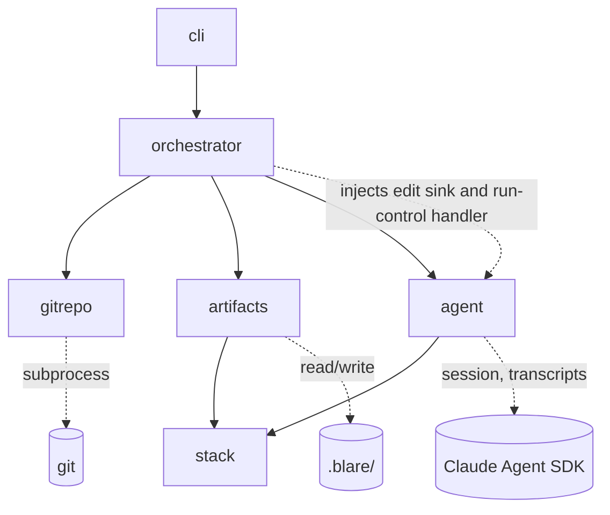

# Blare — Architecture

## Decisions needed from you

This section contains only open items — the absence of a topic means it is settled and logged in
`engineering/decisions.md`.

**No open items.** All decisions raised by this document (D6 command names, D7 personal
configuration, D8 agent session structure) are settled and logged in
`engineering/decisions.md`; D6 and D7 close the two items the spec deferred to this phase.
This document has not yet been approved. Changes in this revision (fifth review round, the
last — it found no contradictions): the per-batch content check applies R19's structural
rules to the resulting candidate set (acyclicity, reference integrity including removals),
guaranteeing every written set passes its own next load; system-originated amendments offer
no rejection — the options at that gate are steering the repair through chat or aborting —
closing the livelock the unit-rejection rule would otherwise compose into.

---

## Overview

Blare is a Python CLI, built with Bazel, that orchestrates an interactive agent run over a
target git repository and maintains the artifact set under `.blare/`. Its two commands are
`blare analyze` and `blare update`. Six modules:



## Modules

- **cli** — entry point and terminal surface: command parsing, checkpoint presentation, the
  free-form chat loop, result summaries and error rendering (per `brand/design-language.md`
  §6), TTY detection. Contains no run logic: it renders what the orchestrator reports and
  forwards what the user types.
- **orchestrator** — the run lifecycle: preflight sequence (environment, lock, validation),
  the phase state machine with checkpoints, amendments and their atomic cascades, final
  confirmation including the write-time re-check, atomic write ordering, run summary. Owns
  the lock, the exit-code taxonomy, the phase-state rule (which phases are open), and the
  run's pending edit set: it injects the edit sink and run-control handler that the agent's
  tools call into. The only module that coordinates the others.
- **gitrepo** — all git access, via the `git` subprocess: repo discovery, SHA resolution and
  ancestry, dirty-tree check (excluding `.blare/` and git-ignored files), effective-delta
  computation, and the repo-id (a hash of the repository's top-level worktree path — two
  invocations in the same checkout collide on the lock, R21; different checkouts do not). No
  other module invokes git.
- **artifacts** — everything under `.blare/`: YAML schemas, structural load-time validation
  (R19), the per-batch content check (consulting **stack** for alert-expression syntax), the
  semantic-invariant check (R3–R5 over any candidate artifact set), stable-ID edit
  application, deterministic derived-doc rendering, state and config files (R23, R24), write
  ordering primitives the orchestrator drives. No other module touches `.blare/`.
- **agent** — the Claude Agent SDK boundary: session lifecycle, subscription-login preflight,
  the phase prompts, checkpoint chat pass-through, exposing the edit and run-control tools
  (backed by orchestrator-injected handlers), transcript persistence. The SDK client behind
  it is the system's mock boundary in tests, substituted via the environment-variable seam
  named in Test strategy.
- **stack** — the metrics/alerting stack abstraction: what instrumentation to look for and
  how to express alert rules. One interface, one Prometheus implementation in the MVP.
  Consulted by **agent** (prompt context) and **artifacts** (alert-expression validation).

## Artifact file layout

The spec assigns the exact `.blare/` layout to this document:

```
.blare/
├── config.yaml                  # repo-shared settings (R23)
├── state.yaml                   # analyzed SHA, artifact schema version
├── system-map.yaml              # phase 1
├── failure-modes.yaml           # phase 2
├── metrics.yaml                 # phase 3: implemented-metric inventory
├── metric-recommendations.yaml  # phase 3
├── alert-recommendations.yaml   # phase 4
├── coverage.yaml                # coverage mapping, spans phases 3–4
└── docs/                        # derived views: one .md per entry-based file, same basename
```

`docs/` holds `system-map.md`, `failure-modes.md`, `metrics.md`, `metric-recommendations.md`,
`alert-recommendations.md`, and `coverage.md` (which carries the gap report). These are the
"paths derived docs use" in R1 and R19.

## Cross-cutting decisions (current state)

- **Phase states**: every phase is `unvisited`, `open`, or `frozen`; in diff mode a phase
  judged unaffected stays `unvisited`. Edit batches land only in open phases — the sink
  rejects a batch tagged for a frozen or unvisited phase, stating why. A phase opens three
  ways: the run reaching it in order; a run-control verdict marking an unvisited phase
  affected (R18's dynamic expansion — ahead of or behind the run position, a behind-position
  phase's checkpoint being presented like any other before final confirmation); and the
  amendment mechanism — the single path that re-opens a frozen phase, which may also name
  unvisited phases when a repair lives in one.
- **Edit-proposal protocol**: the agent proposes artifact changes only through an SDK tool
  exposed by the **agent** module, whose handler — the edit sink — is injected by the
  **orchestrator**. The sink enforces the phase-state rule (orchestrator's), then passes the
  batch to **artifacts** for the per-batch content check: edit schema, alert-expression
  syntax via **stack**, phase consistency (each edit must target the tagged phase's
  artifacts, the owned side for coverage entries), and R19's structural rules applied to the
  resulting candidate set — ID uniqueness, reference integrity including removals that would
  dangle a reference from any phase, and `caused_by` acyclicity — so an accepted set always
  passes its own next load. The combined verdict is the tool result the model sees, and an
  accepted batch enters the orchestrator-owned pending edit set. Edits are phase-tagged. Free-text output never mutates
  artifacts. The content check is deliberately not the semantic tier: mid-run sets violate
  R3–R5 by construction (a phase-2 failure mode has no alert until phase 4).
- **Run-control channel**: a second structured tool carries the agent's phase conclusions —
  the initial and revised affected-phase verdicts and the no-impact conclusion in diff mode
  (R18), and amendment proposals against frozen phases (R2). Its handler is likewise
  orchestrator-injected.
- **Amendment mechanism**: the only path that re-opens frozen phases. An amendment starts
  from an agent proposal via run-control (R2), or from a semantic violation at an
  approval gate (a system-originated amendment naming the offending phase). The orchestrator
  opens the named phases, frozen or unvisited; repairs arrive as ordinary batches into the
  now-open phases; **artifacts**
  recomputes references and invariants over the candidate set to find further invalidated
  frozen phases, which join the amendment and are re-opened in turn — blast radius is
  mechanical, never the agent's judgment. At closure the amendment's full changed set is
  re-presented and approved or rejected as one unit (R2): approval re-freezes every involved
  phase; rejection restores each one's pre-amendment results. A system-originated amendment
  offers no rejection — rejecting the repair of an invariant violation would restore a
  violating set and livelock the approval gate; the user's options there are steering the
  repair through chat or aborting the run (R20, nothing written).
- **Pending edits, single write**: edits accumulate in memory per phase, are frozen at each
  checkpoint approval, and are written to `.blare/` once, after final confirmation (R20). The
  state file is written last. The coverage mapping spans phases 3 and 4: its metric side
  freezes at the phase-3 checkpoint, alert-side additions are ordinary phase-4 edits, and a
  phase-4 change to the metric side is an amendment.
- **Three validation points**: (a) structural load-time validation (R19), owned by
  **artifacts**, refuses the run outright; the same inspection owns R1's inverse refusal —
  entry-based or derived-doc-path files present with no state file at `blare analyze`
  initialization. (b) The per-batch check described under Edit-proposal protocol: phase state
  by the **orchestrator**, content by **artifacts**. (c) The semantic-invariant check —
  R3–R5 in full, R4's expression-language clause included, checked via **stack** — owned by
  **artifacts**. It runs at load, where any violation, hand-edited expressions included,
  seeds the affected-phase set (R18); in `blare update` it runs only after the R7
  empty-delta short-circuit, which follows structural load. It runs again at every checkpoint
  approval attempted when no open or affected phase would remain afterwards: checkpoint chat
  can alter results after presentation, so the check gates approval, not presentation. A
  violation there raises a system-originated amendment (see Amendment mechanism), never a
  silent repair, and the run continues. This defines final confirmation operationally: the
  checkpoint approval at which the phase queue is empty and the semantic check passes.
- **Errors**: one error type carrying cause and next action (R13); the orchestrator maps it to
  the exit-code taxonomy; **cli** renders it. No module prints directly except **cli**.
- **Agent session**: one continuous SDK session per run — all four phases and all checkpoint
  chat share it.
- **Transcripts and lock**: under `$XDG_STATE_HOME/blare/<repo-id>/`, with repo-id computed
  by **gitrepo** (see Modules); transcript path is printed at run end (R14); the lock file
  records the owning PID for stale-lock reclaim (R21).
- **Personal configuration**: none in the MVP. `~/.config/blare/` is created only when a
  personal setting first exists; auth is delegated to the Claude Code login.
- **Git via subprocess**: `gitrepo` shells out to the system `git` rather than binding a
  library; behavior matches what the user's own git reports.
- **Determinism**: R9/R16 byte-stability comes from surgical edit application — entries
  outside the edit set keep their existing bytes, including hand-edited formatting — never
  from whole-file re-serialization. Deterministic serialization (stable key order and
  formatting) applies to what Blare itself writes: new or modified entries and the derived
  docs, which render byte-identically from unchanged YAML.

## Test strategy

Levels per the global testing rules: unit tests live beside each module; integration tests
under `tests/integration/`; end-to-end tests under `tests/e2e/`. Bazel tags map the three
suites: fast = `--test_tag_filters=-e2e,-live` preceded by lint (`ruff check`, `mypy
--strict`); full = `-live`; release = `live`. Commands are declared in
`.claude/test-commands.json`, created in the walking-skeleton task.

- **Mock boundary**: the Claude Agent SDK client — nothing else. Git is real (temporary
  repositories built per test); the filesystem is real. SDK mocks replay recorded fixtures
  under `tests/fixtures/claude-sdk/`; until the first live capture they are provisional per
  the global provisional-mock rule, tracked in the agent module's design doc.
- **End-to-end**: drive the installed `blare` binary through a PTY harness (checkpoints are
  interactive by spec, R22), assert exact artifact bytes, exit codes, and summaries against
  the spec's criteria R1–R24. Determinism (R9) makes exact-byte assertions stable. The
  fixture-replaying SDK client is substituted through one environment variable honored by the
  **agent** module — the only test seam in production code, detailed in `agent.md`.
- **Integration**: orchestrator+artifacts+gitrepo against real temp repos (delta computation,
  ancestry refusals, atomic write ordering, lock contention); artifacts+stack for validation.
- **Release**: the full-analysis and diff flows against `~/external_git/miniflux_v2` with the
  live SDK, asserting contract shape (artifacts validate, invariants hold), never exact
  content; each run re-records the SDK fixtures it exercised. It reuses the PTY harness with
  scripted approvals — every checkpoint is approved as presented, satisfying R22's
  interactivity without a human — plus scripted interaction scenarios (chat alterations, an
  amendment rejection, a diff-mode redirect), so fixtures for the interactive paths R2 and
  R18 require are captured live rather than staying provisional; the scenario list lives in
  `agent.md`.

## Module design docs

One per module under `engineering/modules/`: `cli.md`, `orchestrator.md`, `gitrepo.md`,
`artifacts.md`, `agent.md`, `stack.md` — written after this document is approved.

## Task list

Written after the module design docs are approved. Cross-module tasks will be listed here, per
the pipeline rules; the first is the walking skeleton (CLI entry point through orchestrator to
a stubbed agent, one green end-to-end test, `.claude/test-commands.json`).
