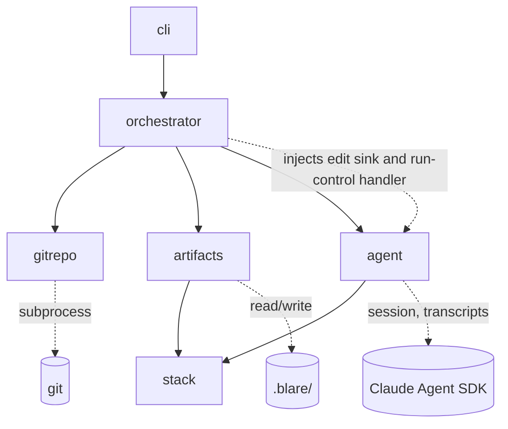

# Blare — Architecture

## Decisions needed from you

This section contains only open items — the absence of a topic means it is settled and logged in
`engineering/decisions.md`.

**No open items.** All decisions raised by this document (D6 command names, D7 personal
configuration, D8 agent session structure) are settled and logged in
`engineering/decisions.md`; D6 and D7 close the two items the spec deferred to this phase.

Changes since last approval: the Tasks section gained **T2.6 live SDK client**, inserted after
T2.5 — building `create_client`'s real (`unset`) branch, discovered missing while scoping T4.1
(no prior task's scope ever included it). It also gained **T4.3 progress feedback**, after
T4.2 — R25's three-module handshake (agent tool-call callback, orchestrator ticker, cli
rendering), added as a new cross-cutting decision and reflected in the agent/orchestrator/cli
module bullets above. And **T4.4 real patch text for triage**, after T4.3 — `gitrepo` gains
`patch_text` (real diff content, no size cap), wired into `RunContext.patch_text` at
preflight step 9, closing a gap hardcoded empty since T2.2 and discovered via T4.1's live
testing. The gitrepo module bullet above is updated to match. Everything else in the Tasks
section, and everything above it, is as previously approved.

---

## Overview

Blare is a Python CLI, built with Bazel, that orchestrates an interactive agent run over a
target git repository and maintains the artifact set under `.blare/`. Its two commands are
`blare analyze` and `blare update`. Six modules:



## Modules

- **cli** — entry point and terminal surface: command parsing, checkpoint presentation, the
  free-form chat loop, periodic progress rendering during a driving call (R25), result
  summaries and error rendering (per `brand/design-language.md` §6), TTY detection. Contains
  no run logic: it renders what the orchestrator reports and forwards what the user types.
- **orchestrator** — the run lifecycle: preflight sequence (environment, lock, validation),
  the phase state machine with checkpoints, amendments and their atomic cascades, final
  confirmation including the write-time re-check, atomic write ordering, run summary. Owns
  the lock, the exit-code taxonomy, the phase-state rule (which phases are open), and the
  run's pending edit set: it injects the edit sink and run-control handler that the agent's
  tools call into. Times every agent-driving call and periodically renders elapsed time plus
  the agent's last tool-call activity through the presenter (R25). The only module that
  coordinates the others.
- **gitrepo** — all git access, via the `git` subprocess: repo discovery, SHA resolution and
  ancestry, dirty-tree check (excluding `.blare/` and git-ignored files), effective-delta
  computation and its full patch text, and the repo-id (a hash of the repository's
  top-level worktree path — two invocations in the same checkout collide on the lock, R21;
  different checkouts do not). No
  other module invokes git.
- **artifacts** — everything under `.blare/`: YAML schemas, structural load-time validation
  (R19), the per-batch content check (consulting **stack** for alert-expression syntax), the
  semantic-invariant check (R3–R5 over any candidate artifact set), stable-ID edit
  application, deterministic derived-doc rendering, state and config files (R23, R24), write
  ordering primitives the orchestrator drives. No other module touches `.blare/`.
- **agent** — the Claude Agent SDK boundary: session lifecycle, subscription-login preflight,
  the phase prompts, checkpoint chat pass-through, exposing the edit and run-control tools
  (backed by orchestrator-injected handlers), a tool-call activity callback for R25's
  progress reporting, transcript persistence. The SDK client behind it is the system's mock
  boundary in tests, substituted via the environment-variable seam named in Test strategy.
- **stack** — the metrics/alerting stack abstraction: what instrumentation to look for and
  how to express alert rules. One interface, one Prometheus implementation in the MVP.
  Consulted by **agent** (prompt context) and **artifacts** (alert-expression validation).

## Artifact file layout

The spec assigns the exact `.blare/` layout to this document:

```
.blare/
├── config.yaml                  # repo-shared settings (R23)
├── state.yaml                   # analyzed SHA, artifact schema version
├── system-map.yaml              # phase 1
├── failure-modes.yaml           # phase 2
├── metrics.yaml                 # phase 3: implemented-metric inventory
├── metric-recommendations.yaml  # phase 3
├── alert-recommendations.yaml   # phase 4
├── coverage.yaml                # coverage mapping, spans phases 3–4
└── docs/                        # derived views: one .md per entry-based file, same basename
```

`docs/` holds `system-map.md`, `failure-modes.md`, `metrics.md`, `metric-recommendations.md`,
`alert-recommendations.md`, and `coverage.md` (which carries the gap report). These are the
"paths derived docs use" in R1 and R19.

## Cross-cutting decisions (current state)

- **Phase states**: every phase is `unvisited`, `open`, or `frozen`; in diff mode a phase
  judged unaffected stays `unvisited`. Edit batches land only in open phases — the sink
  rejects a batch tagged for a frozen or unvisited phase, stating why. A phase opens three
  ways: the run reaching it in order; a run-control verdict marking an unvisited phase
  affected (R18's dynamic expansion — ahead of or behind the run position, a behind-position
  phase's checkpoint being presented like any other before final confirmation); and the
  amendment mechanism — the single path that re-opens a frozen phase, which may also name
  unvisited phases when a repair lives in one.
- **Edit-proposal protocol**: the agent proposes artifact changes only through an SDK tool
  exposed by the **agent** module, whose handler — the edit sink — is injected by the
  **orchestrator**. The sink enforces the phase-state rule (orchestrator's), then passes the
  batch to **artifacts** for the per-batch content check: edit schema, alert-expression
  syntax via **stack**, phase consistency (each edit must target the tagged phase's
  artifacts, the owned side for coverage entries), and R19's structural rules applied to the
  resulting candidate set — ID uniqueness, reference integrity including removals that would
  dangle a reference from any phase, and `caused_by` acyclicity — so an accepted set always
  passes its own next load. The combined verdict is the tool result the model sees, and an
  accepted batch enters the orchestrator-owned pending edit set. Edits are phase-tagged. Free-text output never mutates
  artifacts. The content check is deliberately not the semantic tier: mid-run sets violate
  R3–R5 by construction (a phase-2 failure mode has no alert until phase 4).
- **Run-control channel**: a second structured tool carries the agent's phase conclusions —
  the initial and revised affected-phase verdicts and the no-impact conclusion in diff mode
  (R18), and amendment proposals against frozen phases (R2). Its handler is likewise
  orchestrator-injected.
- **Amendment mechanism**: the only path that re-opens frozen phases. An amendment starts
  from an agent proposal via run-control (R2), or from a semantic violation at an
  approval gate (a system-originated amendment naming the offending phase). The orchestrator
  opens the named phases, frozen or unvisited; repairs arrive as ordinary batches into the
  now-open phases; **artifacts**
  recomputes references and invariants over the candidate set to find further invalidated
  frozen phases, which join the amendment and are re-opened in turn — blast radius is
  mechanical, never the agent's judgment. At closure the amendment's full changed set is
  re-presented and approved or rejected as one unit (R2): approval re-freezes every phase
  that was frozen when the unit opened, while a phase the unit opened from unvisited stays
  open and takes its ordinary checkpoint when the run reaches it — opening a phase for a
  repair never substitutes for running it; rejection restores each involved phase's
  pre-amendment results. A system-originated amendment
  offers no rejection — rejecting the repair of an invariant violation would restore a
  violating set and livelock the approval gate; the user's options there are steering the
  repair through chat or aborting the run (R20, nothing written).
- **Pending edits, single write**: edits accumulate in memory per phase, are frozen at each
  checkpoint approval, and are written to `.blare/` once, after final confirmation (R20). The
  state file is written last. The coverage mapping spans phases 3 and 4: its metric side
  freezes at the phase-3 checkpoint, alert-side additions are ordinary phase-4 edits, and a
  phase-4 change to the metric side is an amendment.
- **Three validation points**: (a) structural load-time validation (R19), owned by
  **artifacts**, refuses the run outright; the same inspection owns R1's inverse refusal —
  entry-based or derived-doc-path files present with no state file at `blare analyze`
  initialization. (b) The per-batch check described under Edit-proposal protocol: phase state
  by the **orchestrator**, content by **artifacts**. (c) The semantic-invariant check —
  R3–R5 in full, R4's expression-language clause included, checked via **stack** — owned by
  **artifacts**. It runs at load, where any violation, hand-edited expressions included,
  seeds the affected-phase set (R18); in `blare update` it runs only after the R7
  empty-delta short-circuit, which follows structural load. It runs again at every checkpoint
  approval attempted when no open or affected phase would remain afterwards: checkpoint chat
  can alter results after presentation, so the check gates approval, not presentation. A
  violation there raises a system-originated amendment (see Amendment mechanism), never a
  silent repair, and the run continues. This defines final confirmation operationally: the
  checkpoint approval at which the phase queue is empty and the semantic check passes.
- **Progress feedback (R25)**: a three-module handshake, presentation-only and never
  altering turn-taking. **agent** invokes a callback with the tool's name each time it
  dispatches a tool call during a driving call (`run_phase`, `triage`, `chat`,
  `request_repair`, `notify_amendment_outcome`). **orchestrator** times every driving call
  and periodically reports elapsed time plus the most recent tool-call name through the
  presenter for as long as the call is in flight, stopping before the call's own
  result/checkpoint rendering proceeds — progress lines and result rendering never
  interleave. **cli** renders these as a distinct line kind, never a result (`→ `) or a
  prompt.
- **Errors**: one error type carrying cause and next action (R13); the orchestrator maps it to
  the exit-code taxonomy; **cli** renders it. No module prints directly except **cli**.
- **Agent session**: one continuous SDK session per run — all four phases and all checkpoint
  chat share it.
- **Transcripts and lock**: under `$XDG_STATE_HOME/blare/<repo-id>/`, with repo-id computed
  by **gitrepo** (see Modules); transcript path is printed at run end (R14); the lock file
  records the owning PID for stale-lock reclaim (R21).
- **Personal configuration**: none in the MVP. `~/.config/blare/` is created only when a
  personal setting first exists; auth is delegated to the Claude Code login.
- **Git via subprocess**: `gitrepo` shells out to the system `git` rather than binding a
  library; behavior matches what the user's own git reports.
- **Determinism**: R9/R16 byte-stability comes from surgical edit application — entries
  outside the edit set keep their existing bytes, including hand-edited formatting — never
  from whole-file re-serialization. Deterministic serialization (stable key order and
  formatting) applies to what Blare itself writes: new or modified entries and the derived
  docs, which render byte-identically from unchanged YAML.

## Test strategy

Levels per the global testing rules: unit tests live beside each module; integration tests
under `tests/integration/`; end-to-end tests under `tests/e2e/`. Bazel tags map the three
suites: fast = `--test_tag_filters=-e2e,-live` preceded by lint (`ruff check`, `mypy
--strict`); full = `-live`; release = `live`. Commands are declared in
`.claude/test-commands.json`, created in the walking-skeleton task.

- **Mock boundary**: the Claude Agent SDK client — nothing else. Git is real (temporary
  repositories built per test); the filesystem is real. SDK mocks replay recorded fixtures
  under `tests/fixtures/claude-sdk/`; until the first live capture they are provisional per
  the global provisional-mock rule, tracked in the agent module's design doc.
- **End-to-end**: drive the installed `blare` binary through a PTY harness (checkpoints are
  interactive by spec, R22), assert exact artifact bytes, exit codes, and summaries against
  the spec's criteria R1–R24. Determinism (R9) makes exact-byte assertions stable. The
  fixture-replaying SDK client is substituted through one environment variable honored by the
  **agent** module — the only test seam in production code, detailed in `agent.md`.
- **Integration**: orchestrator+artifacts+gitrepo against real temp repos (delta computation,
  ancestry refusals, atomic write ordering, lock contention); artifacts+stack for validation.
- **Release**: the full-analysis and diff flows against `~/external_git/miniflux_v2` with the
  live SDK, asserting contract shape (artifacts validate, invariants hold), never exact
  content; each run re-records the SDK fixtures it exercised. It reuses the PTY harness with
  scripted approvals — every checkpoint is approved as presented, satisfying R22's
  interactivity without a human — plus scripted interaction scenarios (chat alterations, an
  amendment rejection, a diff-mode redirect), so fixtures for the interactive paths R2 and
  R18 require are captured live rather than staying provisional; the scenario list lives in
  `agent.md`.

## Module design docs

One per module under `engineering/modules/`: `cli.md`, `orchestrator.md`, `gitrepo.md`,
`artifacts.md`, `agent.md`, `stack.md` — all approved.

## Tasks

Each task is one branch delivering one reviewable change, built test-first from its named
end-to-end criteria, executed by a coding agent per the development process, and done when
its e2e tests exist and pass, the fast and full suites are green at the branch tip, and its
code review loop has approved. Sections order delivery; tasks within a section are sequential
unless noted. Every task hand-authors the provisional replay fixtures its own e2e scenarios
need and reports them; the main session records any new entries in agent.md's provisional
list (a coding agent never edits design docs). T4.1 is where captures replace them.

### T1 — Foundation

- [x] **T1.1 Walking skeleton**: Bazel workspace, pinned `requirements.txt`, package layout;
  `blare` entry point wired cli → orchestrator → a stubbed SDK client through the fixture
  seam; the PTY e2e harness; two green e2e tests that together touch every wired layer —
  the R11 refusal (outside a git repository, exit 1), and a seam-through run in a minimal
  temp repo with a handshake-only replay fixture that reaches session start and exits 0
  with a placeholder no-op summary (skeleton behavior, superseded by T2.2/T2.3);
  `.claude/test-commands.json` declaring the fast/full/release commands as Bazel tag
  filters, and the repo's `PreToolUse` merge gate running the full command. Traces: R11
  (first clause), R13.
- [x] **T1.2 gitrepo**: the module complete per `gitrepo.md` — interface, answer sets,
  `--no-renames` semantics, contract and failure tests (real git; stub executables). No e2e
  of its own: its behaviour surfaces end-to-end through T2.2's refusals and T3.1's deltas,
  so the done-criterion's e2e clause is satisfied by its design doc's test plan alone.
- [x] **T1.3 stack**: registry, `supported_stacks`, the Prometheus implementation with pinned
  `promql-parser`, both hint fragments, both validators, rule shape; full test plan. No e2e
  of its own: it surfaces through T2.2's R23 refusals and T2.3's alert validation.
- [x] **T1.4 artifacts, read side**: schemas and entry types, `state_exists`,
  `init_inspection`, `read`-path config and stack resolution, structural validation (every
  R19 clause), semantic check with repair-phase attribution, `gap_counts`. Traces: R19, R23,
  R24 (as unit/integration; e2e lands with T2.2).
- [x] **T1.5 artifacts, write side**: `batch_check`, `apply` with mechanical coverage
  completeness, `referencing_phases`, deterministic rendering, surgical write primitives,
  `raw_bytes_match`, `empty_set`. Traces: R9, R10 (unit/integration level; R10's e2e lands
  with T2.3, R9's with T2.5 and T3.1).

### T2 — Full analysis

- [x] **T2.1 agent**: session lifecycle, the two tools over injected handlers, prompt
  templates, `create_client` with replay/record clients and normalization, transcripts,
  error taxonomy; hand-authored provisional fixtures for the analyze happy path. Traces:
  R12 (unit level; its e2e is T2.2's auth refusal) and R14 (unit level; e2e with T2.3).
- [x] **T2.2 orchestrator preflight**: the nine-step sequence (the update-only steps 5–6
  are wired here but exercised end-to-end in T3.x), lock, run log, exit-code taxonomy,
  refusal e2e tests one per criterion — R1's inverse refusal (orphaned canonical files)
  and R19's structural-validation refusal included. Traces: R11, R12, R17, R19, R21, R22,
  R23, R24, R13; R15's code lands here with its e2e in T3.2.
- [x] **T2.3 analyze happy path**: phase engine, checkpoints, cli presenter with the full
  rendering rules, chat loop, final gate, write path with re-checks; e2e over replay
  fixtures: fresh analyze (R1), checkpoint interaction (R2), chains (R3), coverage and
  alerts (R4, R5), abort paths (R20), summaries (R13, R14), and derived-doc discipline
  (R10: generated header present; a derived doc edited *during a checkpoint pause of the
  same run* — the single-run construction that dodges R1's inverse refusal — is restored
  at final confirmation, and the abort variant of the same setup shows no restoration).
- [x] **T2.4 amendments**: unit mechanics, frozen-only cascade, system amendments, the
  closure loop, outcome notification; e2e per the amendment scenarios. Traces: R2
  (amendment clauses), R3–R5 invariants at the gate.
- [x] **T2.5 re-analysis**: `blare analyze` over an existing state file, ID and byte
  stability. Traces: R16, R9.
- [x] **T2.6 live SDK client**: `create_client`'s `unset` branch — construct the real
  `claude_agent_sdk.ClaudeSDKClient` via `ClaudeAgentOptions` with no model override (2026-07-30
  decision: unpinned, the Claude Code subscription default), wired into `start`'s existing
  auth-handshake preflight (T2.1/T2.2's `AuthRequiredError` path) and the two in-process MCP
  tools already built in T2.1. Also wires the `record:<dir>` branch's real client into the
  already-complete, already-unit-tested `_RecordingSDKClient` it wraps — no new recorder logic,
  just the live client to pass it. Discovered missing while scoping T4.1: no prior task's scope
  included it (T2.1 explicitly scoped only the replay/record fixture machinery), and T4.1
  cannot run without it. No new e2e coverage of its own — this task's own correctness surfaces
  through T4.1's live release run, which is the first thing that ever exercises this branch for
  real.

### T3 — Diff mode

- [x] **T3.1 update core**: triage, verdict seeding, the R7 short-circuit, no-impact flow,
  SHA-only advance; e2e per criterion. Traces: R6, R7, R8, R9, R18.
- [x] **T3.2 update edges**: dynamic expansion (ahead and behind), load-seeded violation
  repairs, redirect at the no-impact confirmation, R15's refusals with both recovery
  options. Traces: R15, R18 (dynamic clauses).

### T4 — Release readiness

- [ ] **T4.1 release suite** (in progress — 3 of 16 scenarios captured, driver built): the
  scripted PTY scenarios against `~/external_git/miniflux_v2` in record mode — one per entry
  on agent.md's provisional list, which is the binding enumeration; captured fixtures
  replace the provisional set, and emptying that list is this task's definition of done, per
  the global rule that it gates the first release. Driver and 3 real captures landed
  (analyze-happy-path, analyze-reanalysis-update, update-load-seeded-repair — see agent.md).
  T4.4 closed the `patch_text=""` gap that blocked 5 update-mode scenarios
  (update-happy-path, update-multi-commit, update-dynamic-expansion, update-no-impact,
  update-no-impact-redirect) — unblocked, but **not re-attempted**: per the user's explicit
  instruction (2026-07-31, following a live-run timing analysis), T4.1 does not run again
  until the checkpoint-wait/gate-timing concern is addressed first (see decisions.md).
  Remaining, not diff-content-blocked: analyze-reanalysis-noop (3 live attempts didn't
  converge — needs a different approach, not necessarily a code fix), auth-required,
  amendment-system, amendment-agent (×2), amendment-cascade (×2), analyze-checkpoint-chat
  (not yet attempted).
- [x] **T4.2 user documentation**: `README.md` per the pipeline's step 6 (description, when
  to use and not, install, quick start), written to the brand voice.
- [x] **T4.3 progress feedback**: R25 — `agent`'s tool-call activity callback (firing for
  every tool call, including the SDK's own filesystem-read tools, not only `propose_edits`/
  `run_control`), the orchestrator's per-driving-call ticker (injected clock, per
  orchestrator.md's Test plan), and `cli`'s new `progress` rendering. Discovered via live
  user testing (a real run gave no indication of which phase was active or whether it was
  still alive across phases running minutes to nearly two hours). e2e: a fixture scripting
  a slow phase (several scripted tool calls before `turn_end`, replayed with an injected
  delay or fake clock advancing between them) asserts progress lines appear on the PTY
  before the checkpoint renders, naming the phase and updating `last_activity`. Traces:
  R25.
- [x] **T4.4 real patch text for triage**: `gitrepo.patch_text` (new — real diff content
  for the same range `effective_delta` already covers, no size cap per gitrepo.md's
  Decisions), wired into `RunContext.patch_text` at preflight step 9, replacing the `""`
  hardcoded since T2.2. Discovered via T4.1's live testing: the model, given no real diff,
  correctly defaulted to no-impact for a substantive commit. Once wired, every recorded
  fixture that reaches triage over a non-empty delta will byte-mismatch against its
  hardcoded `"patch_text": ""` — this task must update the `patch_text` field in all six:
  `update-happy-path`, `update-multi-commit`, `update-no-impact`, `update-no-impact-redirect`,
  `update-dynamic-expansion`, `update-load-seeded-repair`, with plausible content matching
  each scenario's described file changes (real diff text for `update-load-seeded-repair`
  specifically only if convenient — T4.1 found its behavior is orchestrator-driven, not
  diff-content-driven, so a representative patch body is sufficient there). New contract
  test in `test_orchestrator.py`: `RunContext.patch_text` (asserted via `FakeAgentSession
  .started_with`, alongside the existing `context.delta_files` assertion) carries
  `gitrepo.patch_text`'s return value for the captured range. Unblocks re-attempting
  update-happy-path, update-multi-commit, update-dynamic-expansion, and a genuine
  update-no-impact/-redirect against the live SDK once merged (T4.1's continuation, not this
  task's own scope).
